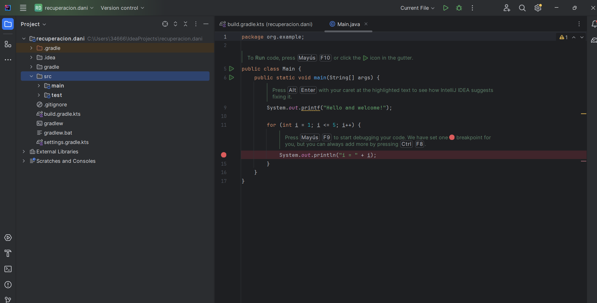
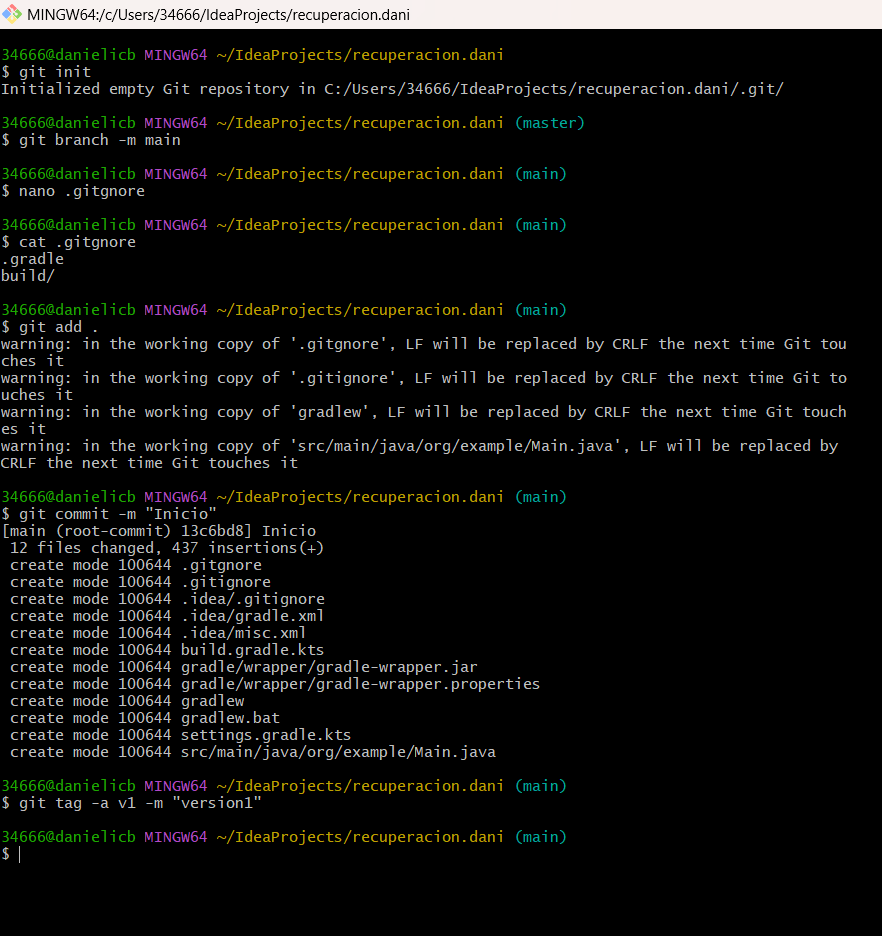
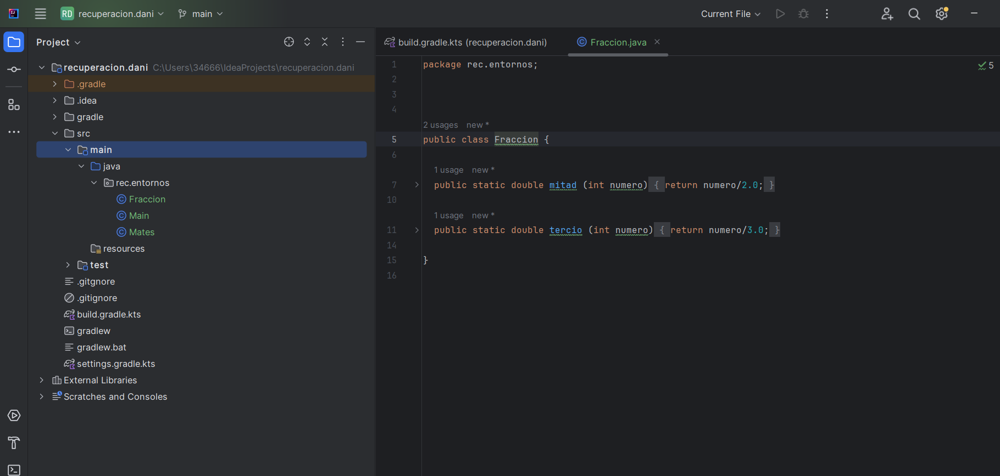
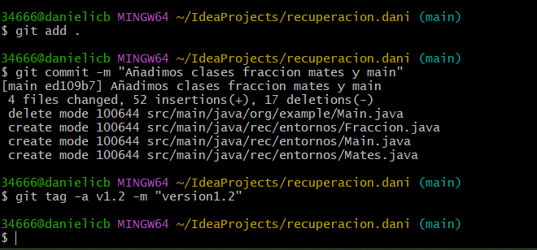
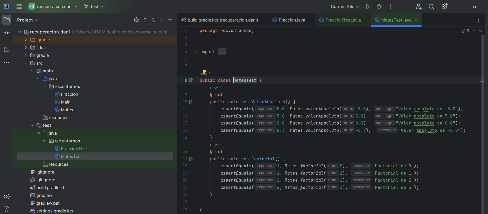
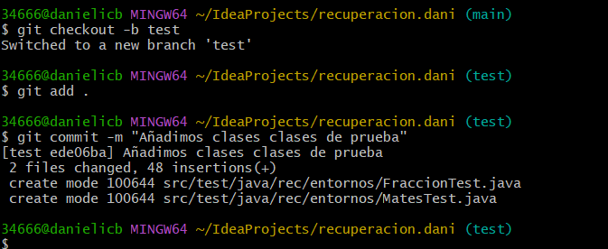
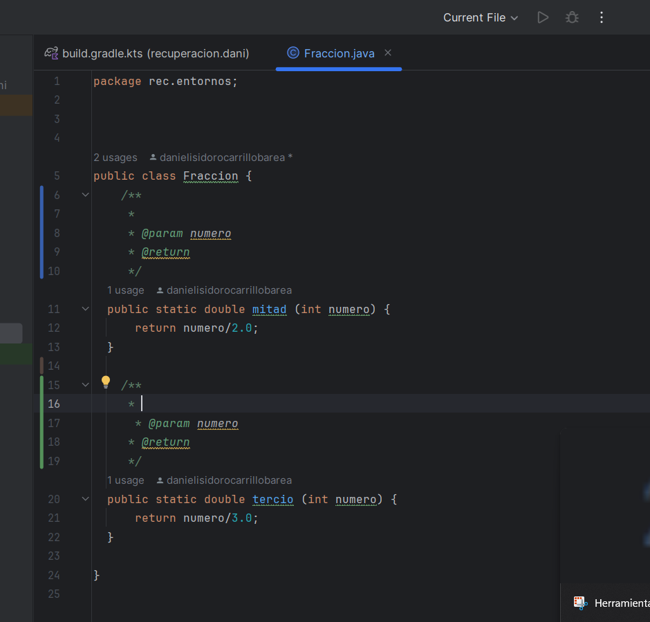
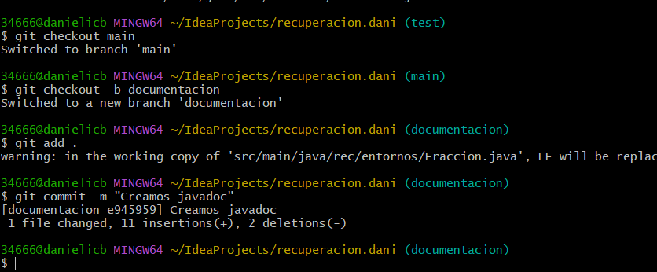

#RECUPERACION DE TEMA4 - ENTORNOS DE DESARROLLO#

**DOCUMENTACIÓN, OPTIMIZACIÓN Y CONTROL DE VERSIONES**

***daniel isidoro carrillo barea***

##ejercicio 1##

##ejercicio 2##

##ejercicio 3##

##ejercicio 4##

